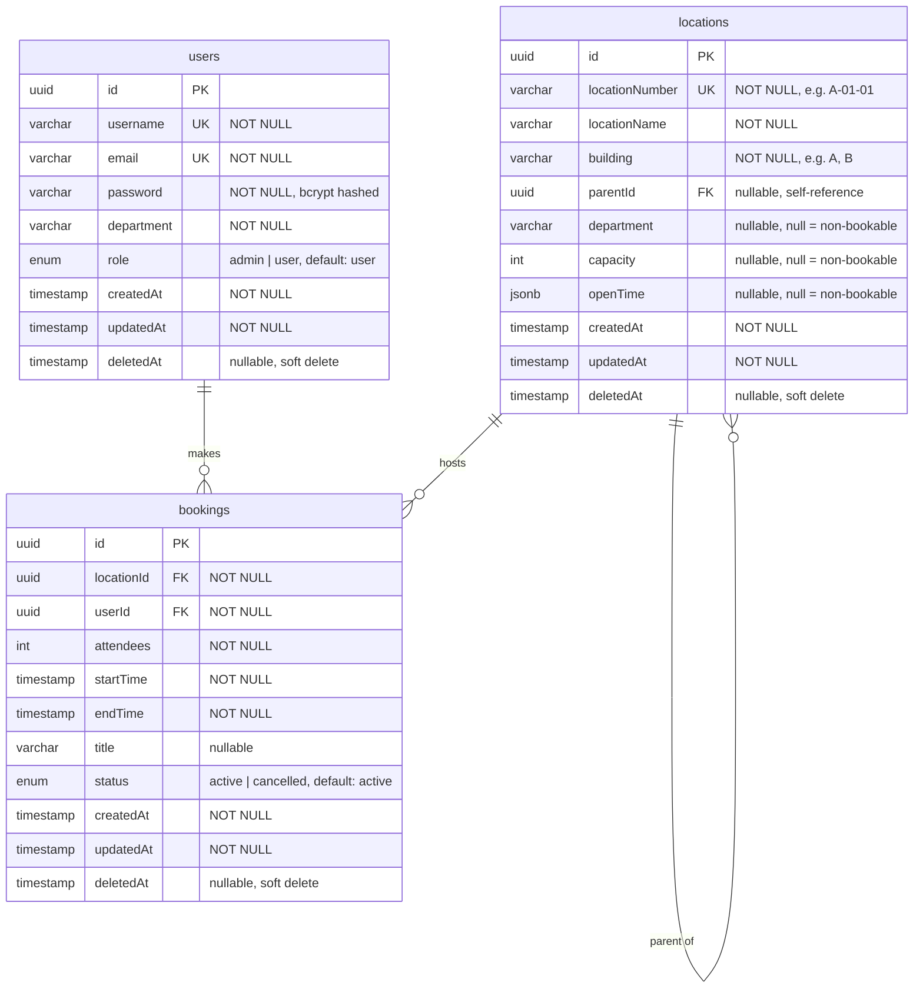

# Database Design

## Entity Relationship Diagram



---

## Table Definitions

### `users`

| Column | Type | Constraints | Description |
|--------|------|-------------|-------------|
| `id` | `uuid` | PK, default `gen_random_uuid()` | Primary key |
| `username` | `varchar(100)` | NOT NULL, UNIQUE | Login username |
| `email` | `varchar(255)` | NOT NULL, UNIQUE | User email |
| `password` | `varchar(255)` | NOT NULL | bcrypt hashed password |
| `department` | `varchar(50)` | NOT NULL | e.g. EFM, FSS, AVS, ASS |
| `role` | `enum('admin','user')` | NOT NULL, default `'user'` | Access level |
| `createdAt` | `timestamp` | NOT NULL | Auto-set on insert |
| `updatedAt` | `timestamp` | NOT NULL | Auto-set on update |
| `deletedAt` | `timestamp` | nullable | Soft delete marker |

---

### `locations`

| Column | Type | Constraints | Description |
|--------|------|-------------|-------------|
| `id` | `uuid` | PK, default `gen_random_uuid()` | Primary key |
| `locationNumber` | `varchar(50)` | NOT NULL, UNIQUE | Human-readable path, e.g. `A-01-01` |
| `locationName` | `varchar(200)` | NOT NULL | Display name, e.g. `Meeting Room 1` |
| `building` | `varchar(10)` | NOT NULL | Building identifier, e.g. `A`, `B` |
| `parentId` | `uuid` | nullable, FK → `locations.id` | Self-reference for tree hierarchy |
| `department` | `varchar(50)` | nullable | Assigned dept — `null` means not bookable |
| `capacity` | `int` | nullable | Max attendees — `null` means not bookable |
| `openTime` | `jsonb` | nullable | Schedule — `null` means not bookable |
| `createdAt` | `timestamp` | NOT NULL | Auto-set on insert |
| `updatedAt` | `timestamp` | NOT NULL | Auto-set on update |
| `deletedAt` | `timestamp` | nullable | Soft delete marker (cascades to children) |

**Bookable location rule:** A location is bookable only when `department`, `capacity`, and `openTime` are all non-null.

---

### `bookings`

| Column | Type | Constraints | Description |
|--------|------|-------------|-------------|
| `id` | `uuid` | PK, default `gen_random_uuid()` | Primary key |
| `locationId` | `uuid` | NOT NULL, FK → `locations.id` | The booked room |
| `userId` | `uuid` | NOT NULL, FK → `users.id` | Who made the booking |
| `attendees` | `int` | NOT NULL | Number of attendees |
| `startTime` | `timestamp` | NOT NULL | Booking start (inclusive) |
| `endTime` | `timestamp` | NOT NULL | Booking end (exclusive) |
| `title` | `varchar(200)` | nullable | Optional meeting title |
| `status` | `enum('active','cancelled')` | NOT NULL, default `'active'` | Booking state |
| `createdAt` | `timestamp` | NOT NULL | Auto-set on insert |
| `updatedAt` | `timestamp` | NOT NULL | Auto-set on update |
| `deletedAt` | `timestamp` | nullable | Soft delete marker |

---

## openTime JSONB Schema

The `openTime` column stores operating schedule as JSON. Two variants:

### Scheduled (specific days + hours)
```json
{
  "type": "scheduled",
  "daysFrom": "Mon",
  "daysTo": "Fri",
  "openHour": 9,
  "closeHour": 18
}
```

### Always open
```json
{
  "type": "always"
}
```

### Day values
`"Mon"` | `"Tue"` | `"Wed"` | `"Thu"` | `"Fri"` | `"Sat"` | `"Sun"`

### Examples

| Room | openTime JSON |
|------|--------------|
| Meeting Room 1 (EFM) | `{ "type": "scheduled", "daysFrom": "Mon", "daysTo": "Fri", "openHour": 9, "closeHour": 18 }` |
| Meeting Room 2 (AVS) | `{ "type": "scheduled", "daysFrom": "Mon", "daysTo": "Sat", "openHour": 9, "closeHour": 18 }` |
| Utility Room (ASS) | `{ "type": "always" }` |
| Genset Room (ASS) | `{ "type": "scheduled", "daysFrom": "Mon", "daysTo": "Sun", "openHour": 9, "closeHour": 18 }` |

---

## Location Tree Structure

The tree uses an **adjacency list** — each node stores only its `parentId`. The full hierarchy is assembled in the application layer.

```
Building A  (parentId: null)
├── Floor 1  A-01  (parentId: Building A)
│   ├── A-01-Lobby       (parentId: Floor 1)
│   ├── A-01-Corridor    (parentId: Floor 1)
│   ├── Meeting Room 1   A-01-01  (parentId: Floor 1)  ← bookable
│   └── Meeting Room 2   A-01-02  (parentId: Floor 1)  ← bookable
└── Floor 2  A-02  (parentId: Building A)
    └── ...

Building B  (parentId: null)
└── Floor 5  B-05  (parentId: Building B)
    ├── Utility Room     B-05-11  (parentId: Floor 5)  ← bookable
    ├── Sanitary Room    B-05-12  (parentId: Floor 5)  ← bookable
    └── ...
```

**Soft-delete cascade:** When a node is deleted, the service recursively collects all descendant IDs and bulk soft-deletes them in a single query.

---

## Index Strategy

| Table | Index | Type | Reason |
|-------|-------|------|--------|
| `users` | `username` | UNIQUE | Fast lookup on login |
| `users` | `email` | UNIQUE | Fast lookup on login |
| `locations` | `locationNumber` | UNIQUE | Enforce uniqueness, fast lookup |
| `locations` | `building` | BTREE | Filter locations by building |
| `locations` | `parentId` | BTREE | Fast children lookup when building tree |
| `bookings` | `(locationId, startTime, endTime)` | BTREE composite | Overlap conflict check query |
| `bookings` | `userId` | BTREE | Fetch user's own bookings |
| `bookings` | `status` | BTREE | Filter active bookings in overlap check |

### Overlap Query
The conflict check for a new booking `[reqStart, reqEnd)` on `locationId`:

```sql
SELECT id FROM bookings
WHERE locationId = :locationId
  AND status = 'active'
  AND deletedAt IS NULL
  AND startTime < :reqEnd
  AND endTime > :reqStart
```

The composite index on `(locationId, startTime, endTime)` makes this query fast.
