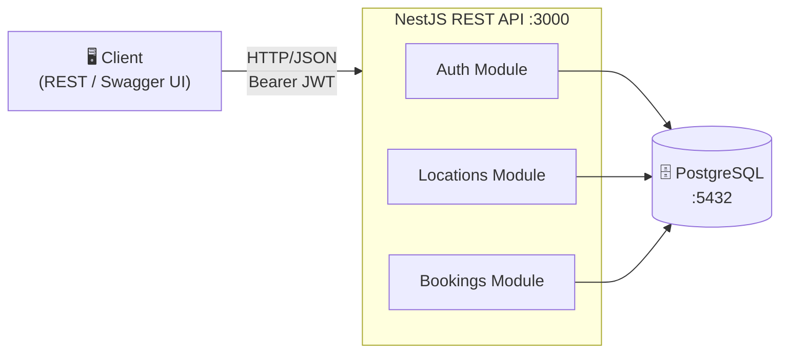
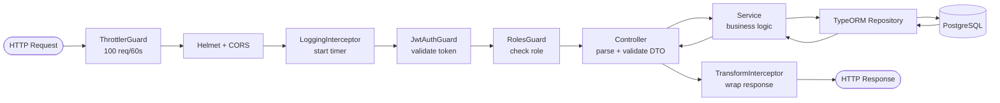
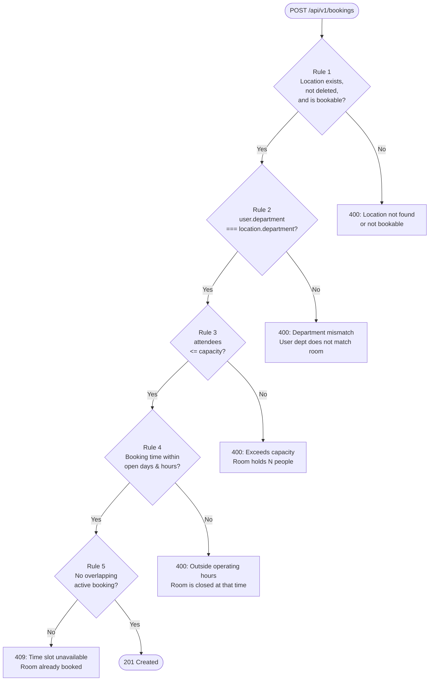

# System Design

## Overview

A RESTful API backend for building location management and room booking, built with NestJS + TypeScript + TypeORM + PostgreSQL.

---

## Architecture Diagram

---

## Module Breakdown

### Auth Module
- **AuthController** — `POST /auth/register`, `POST /auth/login`
- **AuthService** — password hashing (bcrypt), JWT signing, credential validation
- **JwtStrategy** — validates bearer token, attaches `{ id, email, role, department }` to `request.user`
- **JwtAuthGuard** — protects routes, returns 401 if token missing/invalid
- **RolesGuard** — reads `@Roles(Role.Admin)` decorator, returns 403 if role insufficient
- **@CurrentUser()** — parameter decorator to extract user from request cleanly

### Users Module
- **UsersService** — `findByEmail()`, `findById()`, `create()` — used internally by Auth

### Locations Module
- **LocationsController** — CRUD endpoints + tree endpoint
- **LocationsService** — tree building (recursive), soft-delete cascade (recursively collects all child IDs before bulk soft-delete)

### Bookings Module
- **BookingsController** — CRUD endpoints, scoped by role (admin sees all, user sees own)
- **BookingsService** — orchestrates validation then persistence
- **BookingValidatorService** — 5 sequential validation rules (see Booking Validation Flow below)

### Common
| Component | Purpose |
|-----------|---------|
| `AllExceptionsFilter` | Catches all errors, returns consistent `{ statusCode, message, error, path, timestamp }` |
| `LoggingInterceptor` | Logs `[METHOD] /path → status (Xms)` on every request |
| `TransformInterceptor` | Wraps 2xx responses: `{ data: T, meta?: PaginationMeta }` |
| `ThrottlerGuard` | Global rate limit: 100 requests / 60 seconds |

---

## Request Lifecycle

Any step can throw — the `AllExceptionsFilter` catches all unhandled errors and formats them before the response leaves.

---

## Booking Validation Flow

---

## API Versioning & Base Path

All endpoints are prefixed with `/api/v1`.

| Module | Base Path |
|--------|-----------|
| Auth | `/api/v1/auth` |
| Locations | `/api/v1/locations` |
| Bookings | `/api/v1/bookings` |
| Health | `/api/v1/health` |
| Docs | `/api/docs` (Swagger UI) |

---

## Tech Stack Decisions

| Decision | Choice | Reason |
|----------|--------|--------|
| Framework | NestJS | Module-based architecture maps cleanly to domain boundaries. DI container simplifies testing. |
| ORM | TypeORM | Decorator-based entities, migration support, repository pattern. |
| Tree storage | Adjacency list (`parentId` FK) | Simple to query, easy to understand. Recursive service method handles tree building and cascade deletes in application layer — avoids complex DB-level recursive CTEs for this scale. |
| Soft delete | `deletedAt` timestamp | Preserves audit history. Cascade implemented in service: on delete, recursively fetch all descendant IDs, bulk-set `deletedAt`. |
| openTime storage | JSONB column | Flexible schema for `scheduled` vs `always` types without extra tables. Queried only at validation time, not for indexing. |
| Auth | JWT (stateless) | No session storage needed. Token carries `{ id, role, department }` — department matching happens without extra DB lookup. |
| Roles | Enum guard (`admin` / `user`) | Admin manages locations; users make bookings. Clean separation. |
| Password hashing | bcrypt (rounds: 10) | Industry standard. Resistant to brute force. |
| Validation | `class-validator` + `ValidationPipe` | Declarative DTO validation. Errors auto-formatted before reaching controller. |
